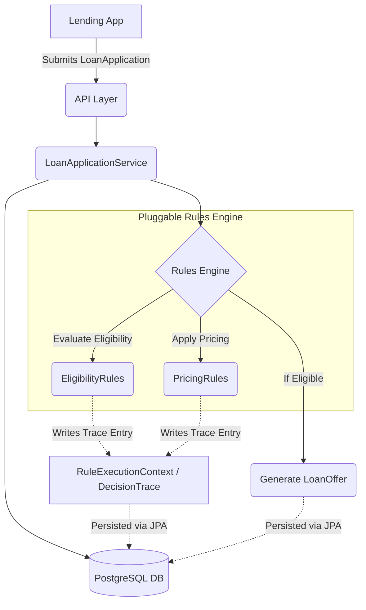
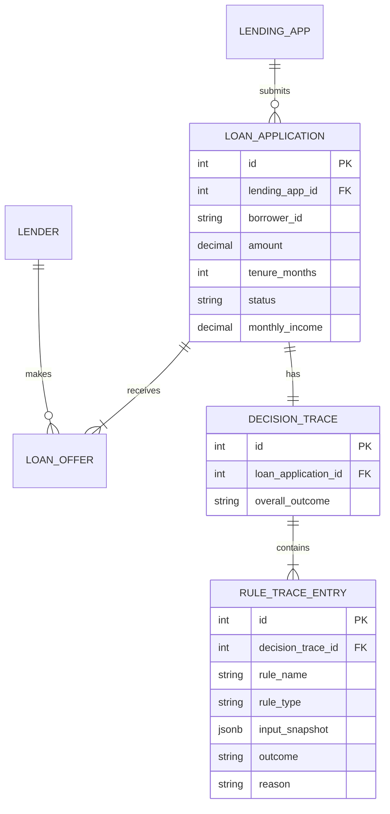

# Architecture Documentation

## System Overview
The Digital Lending Marketplace is designed as a pluggable, rules-driven platform connecting Lending Apps, Borrowers, Lenders, and Loan Service Providers. The primary novelty is the **Explainable Decision Trace**, which records every step of the decision-making process for auditing and compliance.

## Module Breakdown
- **Domain Layer (`com.example.lending.domain`)**: Contains core entities representing business models (Lender, LendingApp, LoanApplication, LoanOffer). Includes the `DecisionTrace` and `RuleTraceEntry` entities to persist the audit trail.
- **Rules Engine Layer (`com.example.lending.rulesengine`)**: Defines the strategy interfaces for eligibility and pricing rules.
- **Trace Novelty Layer (`com.example.lending.rulesengine.trace`)**: Contains the `RuleExecutionContext` which gets passed to each rule. As rules run, they interact with this context to append reasons, inputs, and outcomes to the `DecisionTrace`.
- **Service Layer (`com.example.lending.service`)**: Orchestrates the flow. It dynamically loads all discovered rule beans (via Spring DI) and evaluates them.
- **API Layer (`com.example.lending.controller`)**: REST endpoints for interacting with applications, viewing trails, etc.

## Pluggable Rules Engine Pattern
The engine uses the **Strategy Pattern**. Rules are decoupled from the core service. To add a new lender's custom rule, developers only need to implement the `EligibilityRule` or `PricingRule` interface and annotate it with `@Component`. Spring automatically discovers the bean and injects it into the `LoanApplicationService`. This achieves **zero core code changes** when extending the system.

## The Explainability Layer (Decision Trace)
**Problem Solved**: In regulated lending, rejecting a loan applicant requires an Adverse Action notice explaining *why*. Traditional hardcoded "if/else" logic obscures this reasoning.
**How it Works**: The `RuleExecutionContext` intercepts every rule evaluation. Rules are contractually obligated to append a `RuleTraceEntry` before returning.
**Why it Matters**: Compliance auditors can hit the `/decision-trail` endpoint months later and see exactly which rule failed, what the borrower's input was at that exact timestamp, and the plain-English reason.

## Database ER Diagram

## Key Design Decisions & Trade-offs
- **Flyway vs Hibernate Auto-DDL**: Using Flyway provides deterministic, version-controlled migrations critical for production databases, unlike auto-DDL which is only suitable for rapid local prototyping.
- **Strategy Pattern for Rules**: Traded a simpler monolithic service class for slightly more boilerplate (interfaces + components) to gain infinite extensibility.
- **JSONB for Input Snapshots**: Used a flexible JSON structure in Postgres to capture rule inputs, as different rules check wildly different parameters (e.g., income vs credit score) and a rigid relational model would break.
