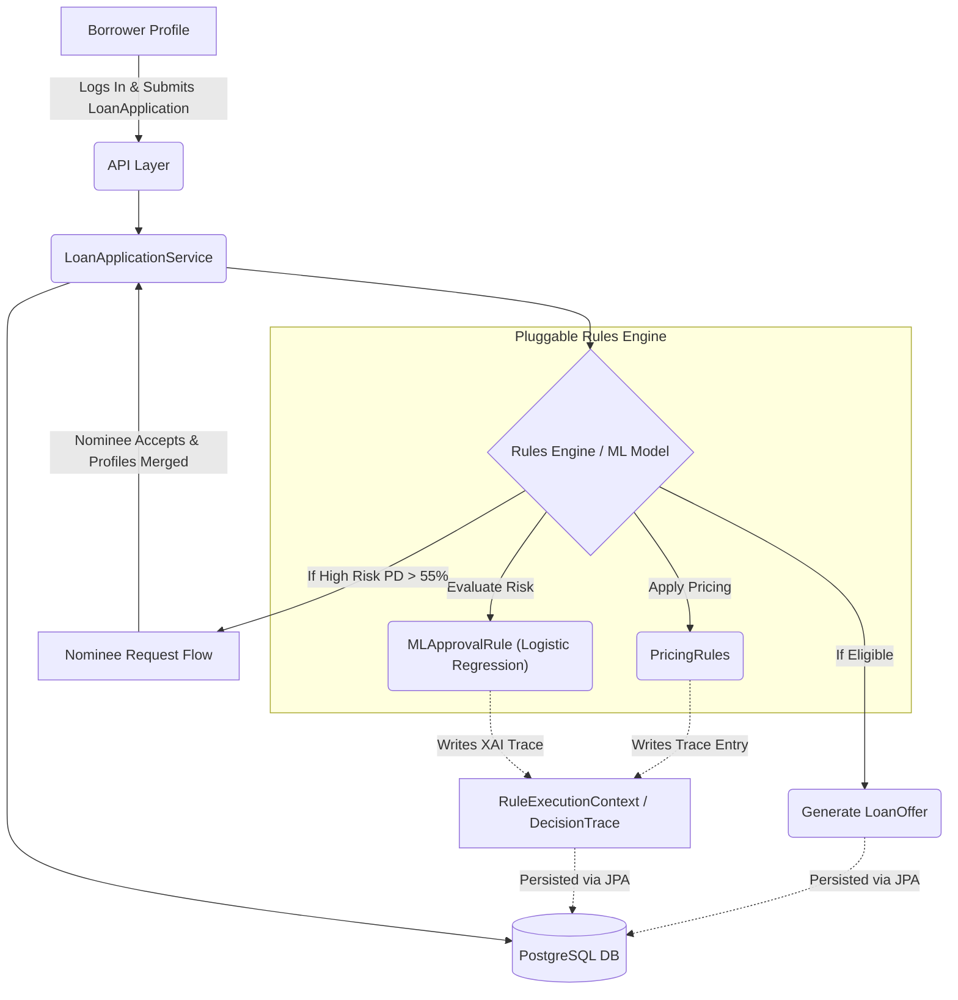
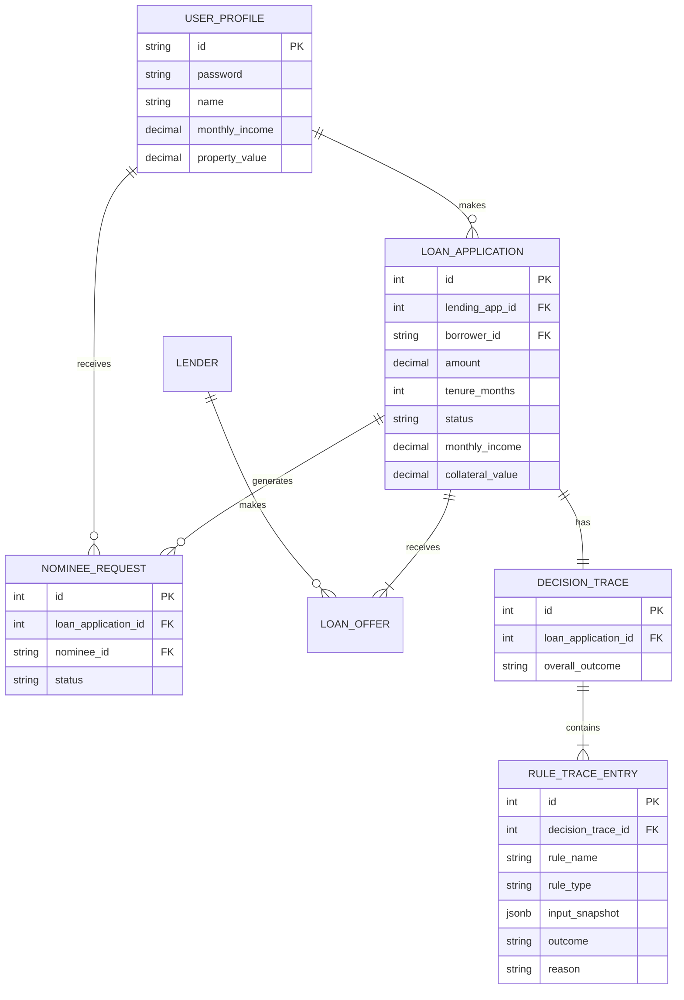

# Architecture Documentation

## System Overview
The Digital Lending Marketplace is a pluggable, rules-driven platform connecting Lending Apps, Borrowers, Lenders, and Loan Service Providers. Its primary novelties are:
1. **Explainable Decision Trace** — every step of the decision pipeline is recorded for regulatory compliance and auditing.
2. **ML-Driven Credit Scoring** — a Logistic Regression model produces a probability-of-default (PD), an estimated credit score, and a full feature-contribution breakdown for Explainable AI (XAI).
3. **Multi-Party Nominee Approval** — if the ML model flags an applicant as high-risk, the system pauses the pipeline and orchestrates a cross-user guarantor flow.



## Module Breakdown
- **Domain Layer (`com.example.lending.domain`)**: Contains core entities — `UserProfile`, `NomineeRequest`, `Lender`, `LendingApp`, `LoanApplication`, `LoanOffer`, `DecisionTrace`, and `RuleTraceEntry`.
- **Rules Engine Layer (`com.example.lending.rulesengine`)**: Defines strategy interfaces (`EligibilityRule`, `PricingRule`). Houses the ML scoring engine (`MLApprovalRule`) which implements a Logistic Regression model with sigmoid activation, feature normalisation, and weighted coefficient contributions.
- **Trace Novelty Layer (`com.example.lending.rulesengine.trace`)**: Contains the `RuleExecutionContext` passed to every rule. Rules are contractually required to append a `RuleTraceEntry` with full input snapshots.
- **Service Layer (`com.example.lending.service`)**: Orchestrates complex multi-party state transitions (`PENDING` → `NOMINEE_REQUIRED` → `NOMINEE_PENDING` → `APPROVED`). Re-hydrates applications with merged borrower + nominee profiles before re-evaluation.
- **API Layer (`com.example.lending.controller`)**: REST endpoints for applications, decision trails, user authentication, and profile management.

## Pluggable Rules Engine Pattern
The engine uses the **Strategy Pattern**. To add a new rule, developers implement `EligibilityRule` or `PricingRule` and annotate with `@Component`. Spring auto-discovers the bean and injects it into `LoanApplicationService`. This achieves **zero core code changes** when extending the system.

## ML Credit Risk Model (Explainable AI)

The `MLApprovalRule` implements a 5-feature **Logistic Regression** classifier:

```
P(default) = σ(w₀ + w₁·DTI + w₂·LTV + w₃·tenure + w₄·amount + w₅·income)
```

| Step | Description |
|------|-------------|
| 1. Feature Extraction | Pull raw values: `monthly_income`, `loan_amount`, `collateral_value`, `tenure_months` |
| 2. Feature Engineering | Derive `DTI` (Debt-to-Income), `LTV` (Loan-to-Value) ratios |
| 3. Normalisation | Clamp all features to `[0, 1]` using training-data-derived constants |
| 4. Weighted Sum (Logit) | `z = intercept + Σ(wᵢ · xᵢ)` for each feature |
| 5. Sigmoid Activation | `P(default) = 1 / (1 + e⁻ᶻ)` → probability of default |
| 6. Credit Score Estimate | `score = (1 - PD) × 850` (mirrors FICO scale) |
| 7. Decision | If `PD > 55%` → HIGH RISK → trigger Nominee Flow |

**XAI Compliance**: The Decision Trace records raw features, normalised features, each feature's weighted contribution to the logit, the logit value, the sigmoid output (PD), and the estimated credit score. Auditors can trace exactly *which feature* drove the risk decision.

## The Explainability Layer (Decision Trace)
**Problem Solved**: In regulated lending, rejecting a loan applicant requires an Adverse Action notice explaining *why*. Traditional hardcoded "if/else" logic obscures this reasoning.
**How it Works**: The `RuleExecutionContext` intercepts every rule evaluation. Rules are contractually obligated to append a `RuleTraceEntry` before returning.
**Why it Matters**: Compliance auditors can hit the `/decision-trail` endpoint months later and see exactly which rule failed, what the borrower's input was at that exact timestamp, and the plain-English reason.

## Database ER Diagram



## Key Design Decisions & Trade-offs
- **Flyway vs Hibernate Auto-DDL**: Flyway provides deterministic, version-controlled migrations critical for production. Auto-DDL is only suitable for rapid prototyping.
- **Strategy Pattern for Rules**: Traded simplicity for infinite extensibility. New rules require zero changes to the service layer.
- **JSONB for Input Snapshots**: Different rules check wildly different parameters. A flexible JSON column avoids schema rigidity.
- **Logistic Regression vs Deep Learning**: Chose Logistic Regression because it is inherently interpretable — each weight directly quantifies a feature's influence on the outcome. Deep learning models are powerful but are "black boxes" that conflict with regulatory explainability requirements (ECOA, FCRA).
- **Sigmoid-based PD over Binary Threshold**: By outputting a probability rather than a binary pass/fail, the system enables nuanced risk tiering (e.g., marginal applications can be rescued by a Nominee guarantor).
